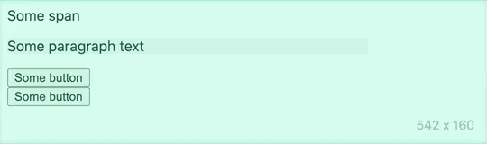

# react-hover-tooltip

Simple, opinionated tooltip. It shows up on mouse hover or on element focus, and it is always anchored to the center of `props.children`.



## Installation

```sh
npm install react-hover-tooltip
```

## Usage

```js
<Tooltip content="Some tooltip content">
  <button>Some button</button>
</Tooltip>

<Tooltip bottom content="This shows up underneath the element">
  <span>Some span</span>
</Tooltip>

// Use `replace` prop when element has custom sizing or positioning
// (adds listeners to the child element instead of a wrapping span)
<Tooltip replace content="Tooltip on a custom-sized div">
  <div style={{ width: 200, height: 300 }}>
    The div's content
  </div>
</Tooltip>
```

## Props

- `content`: The content of the tooltip. Can be a string, or any react element. The tooltip's size will adjust to the size of the content.
- `replace`: If `true`, you must only pass ONE child element. That one child element will be as the event source (`onMouseOver`, `onFocus`) and used to determine sizing (using `getBoundingClientRect`). If set to `false` (the default), a wrapping `span` element will be created around the tooltip children.
- `bottom`: If `true`, renders the tooltip BENEATH the child content instead of above it. Defaults to `false`.

### Can I style it myself?

Unfortunately no.

## Development

Pull the repo, then run `npm run start` to start a development server in the `example/` directory. It should reload as you make changes.
